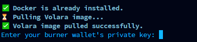
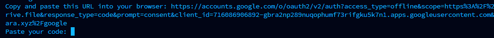
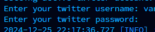
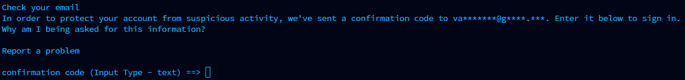
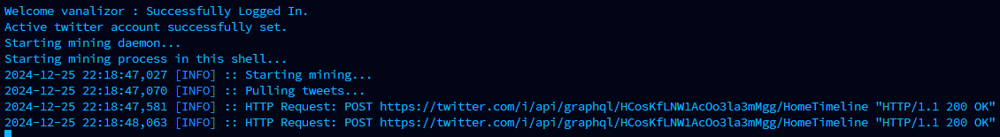

##  Docker Kurulumu

``` 
sudo apt-get update
sudo apt-get install ca-certificates curl
sudo install -m 0755 -d /etc/apt/keyrings
sudo curl -fsSL https://download.docker.com/linux/ubuntu/gpg -o /etc/apt/keyrings/docker.asc
sudo chmod a+r /etc/apt/keyrings/docker.asc
```

## Volara Kurulumu

Direkt olarak linki yapıştırıyoruz

```
[ -f "volara.sh" ] && rm volara.sh; curl -s -o volara.sh https://raw.githubusercontent.com/volaradlp/minercli/refs/heads/main/run_docker.sh && chmod +x volara.sh && ./volara.sh
```

Ekran görüntüleme 
```
screen -S volara
```

Burner cüzdanımızın private keyini giriyoruz



Yönlendirdiği bağlantıya gidiyoruz ve sıfırdan açtığımız mail ile bağlanıp oradaki kodu kopyalayıp buraya yapıştırıyoruz



X kullanıcı adı ve şifre giriyoruz



Maile gelen kodu yapıştırıyoruz



Eğer tüm işlemleri doğru yaptıysanız böyle gözükmeli



Artık hazırsınız, ara sıra [vanascan](https://vanascan.io/) üzerinden adresinizi aratıp token transfer kısmına ve doğrudan [volara](https://volara.xyz/) sitesine bakın. Çalışıp çalışmadığını oradan anlayacaksınız.
